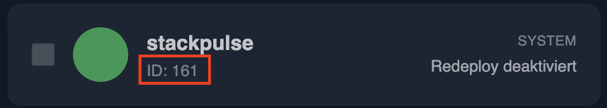

 


# 📦 StackPulse

**StackPulse** ist eine kleine Web-App, die über die Portainer-API deine Docker-Stacks verwaltet und aktualisiert.  
Sie besteht aus einem **Backend (Node.js/Express)** und einem **Frontend (React/Tailwind)**.  

Ziel:  
- Übersicht über alle Stacks in deiner Portainer-Instanz  
- Später: Updates, Deployments und Monitoring  
- Bereitstellung als **Docker Image**, nutzbar über **docker-compose**  

---

## 🚀 Features & Roadmap

<details>
  <summary>✅ v0.1.0 – Initial Release</summary>

- Projektstruktur mit Frontend & Backend  
- Lokales Startskript (`scripts/start-dev.sh`)  
- Frontend zeigt Stacks an (über Backend)  
- API-Verbindung zu Portainer  
- Stack Redeploy  
- Bereitstellung eines Docker Images über GHCR  

</details>

<details open>
  <summary>✅ v0.2.0 – Release</summary>

### Backend
- [x] Anbindung einer SQLite-Datenbank  
- [x] Logging der Redeploy-Aktionen in SQLite speichern  
- [x] API-Endpunkte für Log-Abfragen  
- [x] Funktionen für Pagination, Löschen und Export 

### Frontend
- [x] Anzeige der Logs (inkl. Statusfarben)  
- [x] UI-Komponenten für Log-Details  
- [x] Filterfunktionen für die Logs
- [x] Pagination, Lösch- und Exportanzeigen

### Features
- [x] Selektive Auswahl: einzelne Stacks oder Services neu deployen  

</details>

<details>
  <summary>🔮 Geplante Features (v0.3+)</summary>

- Notifications (z. B. via Webhooks oder Mail)  
- Authentifizierung & Benutzerverwaltung  
- Monitoring (Status, CPU/RAM)  
- Verbesserte UI/UX  

</details>

---

## 🗂️ Projektstruktur

```bash
stackpulse/
├── backend/          # Node.js Backend mit Express
│   └── data          # SQlite Datenbank
│   └── db            # Datenbank-Integration
├── frontend/         # React Frontend mit Tailwind
├── scripts/          # Lokale Hilfsskripte (nicht Teil des Images)
│   └── start-dev.sh  #Skript für den lokalen Start
├── Dockerfile        # Multi-Stage Build für Frontend + Backend
├── docker-compose.yml
└── README.md
```

---

## 🔧 Lokaler Start

### 1. Dev-Server starten (Frontend + Backend)
```bash
./scripts/start-dev.sh
```

➡️ Danach:  
- Frontend → http://Deine-Server-IP:5173  

---

## 🐳 Docker-Setup

### Mit Compose starten
```bash
version: "2.4"
services:
    stackpulse:
        container_name: stackpulse
        image: ghcr.io/mboehmlaender/stackpulse
        ports:
          - '4001:4001'
        environment:
          - PORTAINER_URL=Deine_Portainer_Adresse/
          - PORTAINER_API_KEY=Dein_Portainer_API_Key
          - PORTAINER_ENDPOINT_ID=Deine_Portainer_Endpoint_ID
          - STACK_SELF_ID=ID_deiner_stackpulse_ID
```

Die PORTAINER_ENDPOINT_ID erhältst du, wenn du die die URL im Browser ansiehst, wenn du das Dashboard in Portainer öffnest:


Die 3 wäre in diesem Fall Endpoint-ID.

Die STACK_SELF_ID findest du, wenn du das Frontend von StackPulse öffnest:



Diese ID kann erst nach dem Deploy von Stackpulse ausgelesen werden. Vergiss daher nicht, nach dem Hinterlegen der ID in den Variablen das Stack noch einmal zu redeployen!

---

## 📋 Voraussetzungen

- Node.js >= 20  
- Docker & Docker Compose  
- Zugang zu einer Portainer-Instanz (API-Key erforderlich)

---

## 🤝 Mitmachen

1. Repo forken  
2. Feature-Branch erstellen  
3. PR gegen `dev` öffnen  
